# Komponentträd — Boendeportalen

Kurerat komponentträd på **medelnivå**: root → providers → router → sidor → huvudsektioner/widgetar.

Renderas automatiskt på GitHub och i VS Code (se [data-flow-diagram.md](data-flow-diagram.md) för Mermaid-tips).

**Avgränsning:** generiska UI-primitiver (`Button`, `FilterBox`, `AlertDialog`, `DropDown`, `Breadcrumbs`, `SelectDropDown`, `FormSwitch`) är utelämnade för läsbarhet. Trädet är handritat från koden — inte en runtime-dump — så det visar hela appen oavsett vilken route som är monterad (React DevTools Components-fliken visar bara det som är monterat just nu p.g.a. route-rendering och `lazy()`).

> Delade komponenter (t.ex. `ApartmentList`) ritas som **en** nod med flera inkommande pilar.

```mermaid
flowchart TD
    %% Entry point & providers (main.tsx)
    ROOT["main.tsx<br/>(StrictMode)"] --> BR["BrowserRouter"]
    BR --> AUTHP["AuthProvider"]
    AUTHP --> FEATP["FeaturesProvider"]
    FEATP --> APP["App"]

    %% App-shell
    APP --> HEADER["Header"]
    APP --> ROUTES["Routes<br/>(PublicOnly / Private / Admin-guards)"]
    APP --> FOOTER["Footer"]
    HEADER --> MOBILE["MobileMenu"]

    %% Routes → sidor
    ROUTES --> HOME["HomePage<br/>/"]
    ROUTES --> AUTH["Auth<br/>/inloggning"]
    ROUTES --> PROFILE["ProfilePage<br/>/minasidor"]
    ROUTES --> SEARCH["SearchApartment<br/>/bostader"]
    ROUTES --> APARTMENT["Apartment<br/>/bostader/:apartmentId"]
    ROUTES --> PARKING["Parking<br/>/parkeringar"]
    ROUTES --> PARKDET["ParkingDetails<br/>/parkeringar/:parkingId"]
    ROUTES --> LAUNDRY["LaundryRoom<br/>/tvattstuga"]
    ROUTES --> GUEST["GuestSuite<br/>/gastlagenhet"]
    ROUTES --> ADMIN["AdminPage<br/>/admin/*"]

    %% HomePage
    HOME --> LANDING["Landing"]
    HOME --> HOMEINNER["Home"]

    %% Auth
    AUTH --> LOGIN["Login"]
    AUTH --> REGISTER["Register"]
    AUTH --> FORGOT["ForgotPassword"]
    AUTH --> RESET["ResetPassword"]

    %% ProfilePage
    PROFILE --> PINFO["PersonalInfoSection"]
    PROFILE --> POVERVIEW["ApartmentOverviewCard"]
    PROFILE --> PDOCS["ApartmentDocumentsSection"]
    PROFILE --> PAPPLIED["AppliedSection"]
    PROFILE --> PPARK["MyParkingSection"]
    PROFILE --> PFORMS["ProfileFormsSection"]
    PFORMS --> FERR["ErrorReportForm"]
    PFORMS --> FSRV["AdditionalServiceForm"]

    %% Lägenhetssökning & detalj
    SEARCH --> APLIST["ApartmentList"]
    APLIST --> APCARD["ApartmentCard"]
    APARTMENT --> CAROUSEL["ImageCarousel"]
    APARTMENT --> SIGNUP["ApartmentSignUp"]
    APARTMENT --> APLIST

    %% Parkering
    PARKING --> PKLIST["ParkingList"]
    PKLIST --> PKCARD["ParkingCard"]
    PARKDET --> MAP["LeafletMap"]

    %% Bokningar
    LAUNDRY --> LCAL["LaundryRoomCalendar"]
    LAUNDRY --> LINFO["LaundryRoomInfo"]
    GUEST --> GCAL["GuestSuiteCalendar"]
    GUEST --> GINFO["GuestSuiteInfo"]

    %% Admin
    ADMIN --> DASH["DashboardPage<br/>/admin/dashboard"]
    ADMIN --> USERS["UsersPage<br/>/admin/users"]
    ADMIN --> SETTINGS["SettingsPage<br/>/admin/settings"]
    DASH --> WIDGET["Widget / ExpandedWidget"]
    WIDGET --> WISSUES["Issues"]
    WIDGET --> WMSG["Messages<br/>(compose-formulär)"]
    WIDGET --> WTEN["Tenants"]
    WIDGET --> WRES["Resources"]
```

---

## Noteringar

- **Providers** monteras i [main.tsx](../src/main.tsx): `BrowserRouter → AuthProvider → FeaturesProvider → App`.
- **Route-guards** (`PublicOnlyRouteWrapper`, `PrivateRouteWrapper`, `AdminRouteWrapper`) wrappar varje route i [App.tsx](../src/App.tsx) men är utelämnade som egna noder — sammanfattade på `Routes`.
- **`ProfilePage`** renderar även `ProfilePageSkeleton` under laddning (utelämnad ovan).
- **`AppliedSection`** är en generisk komponent som återanvänds för intresseanmälda lägenheter.
- **Dashboard-widgetarna** (`Issues`, `Messages`, `Tenants`, `Resources`) väljs dynamiskt utifrån feature-flaggor med `type_slug === 'admin_widgets'` — se [data-flow-diagram.md](data-flow-diagram.md) sektion 7–8.
