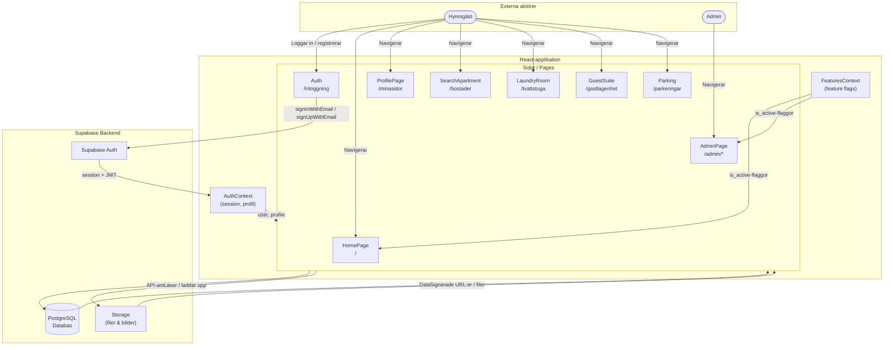
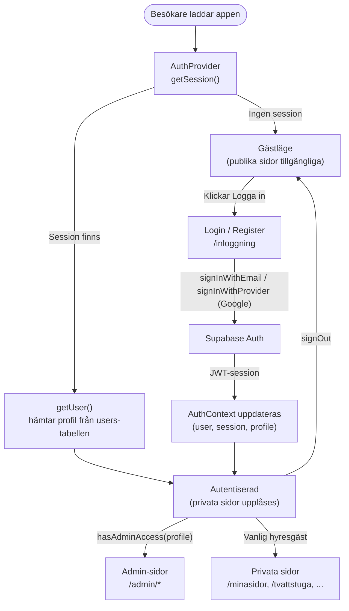
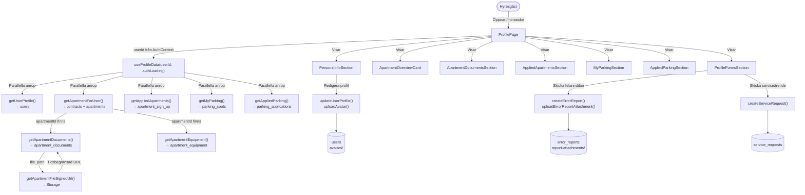
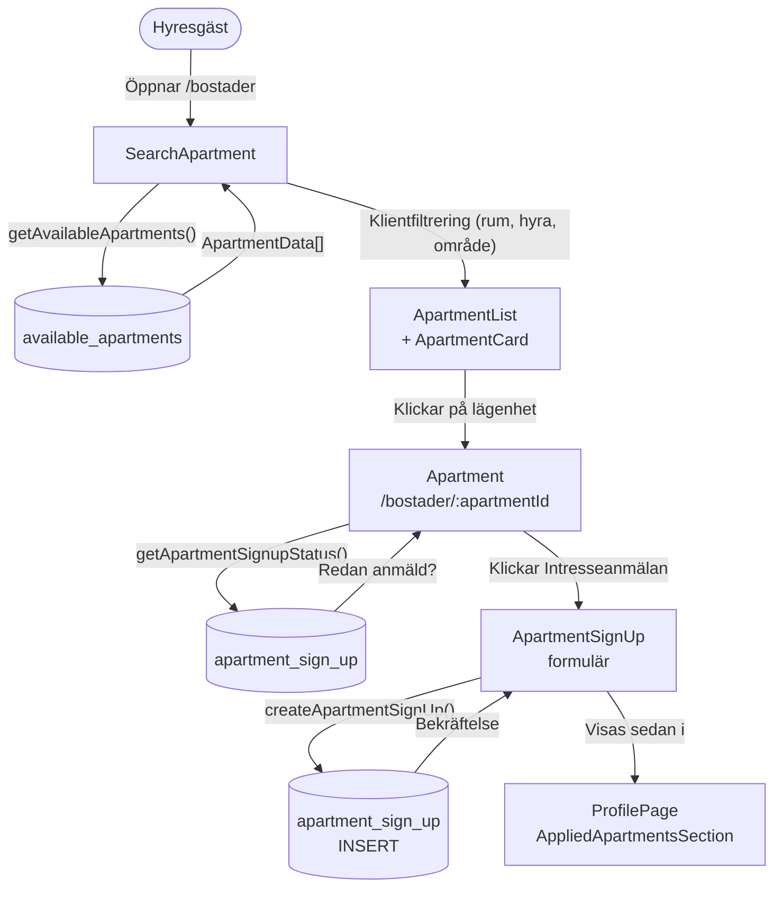
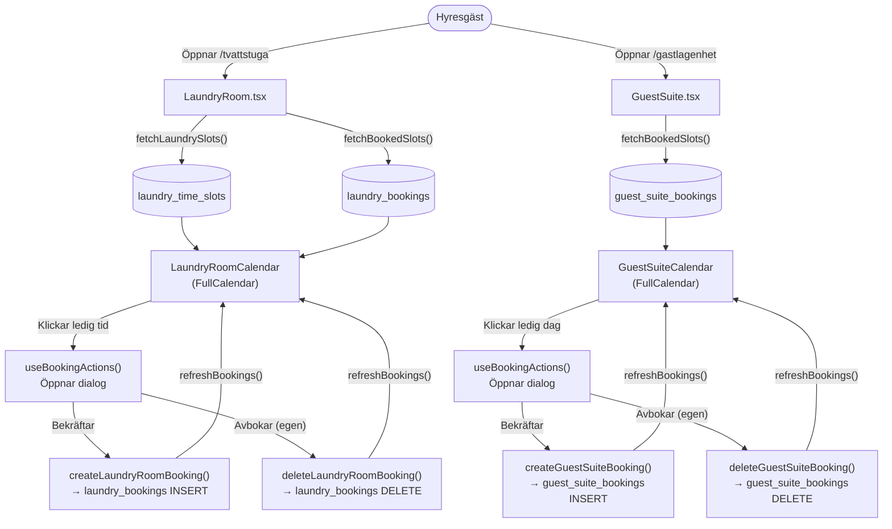
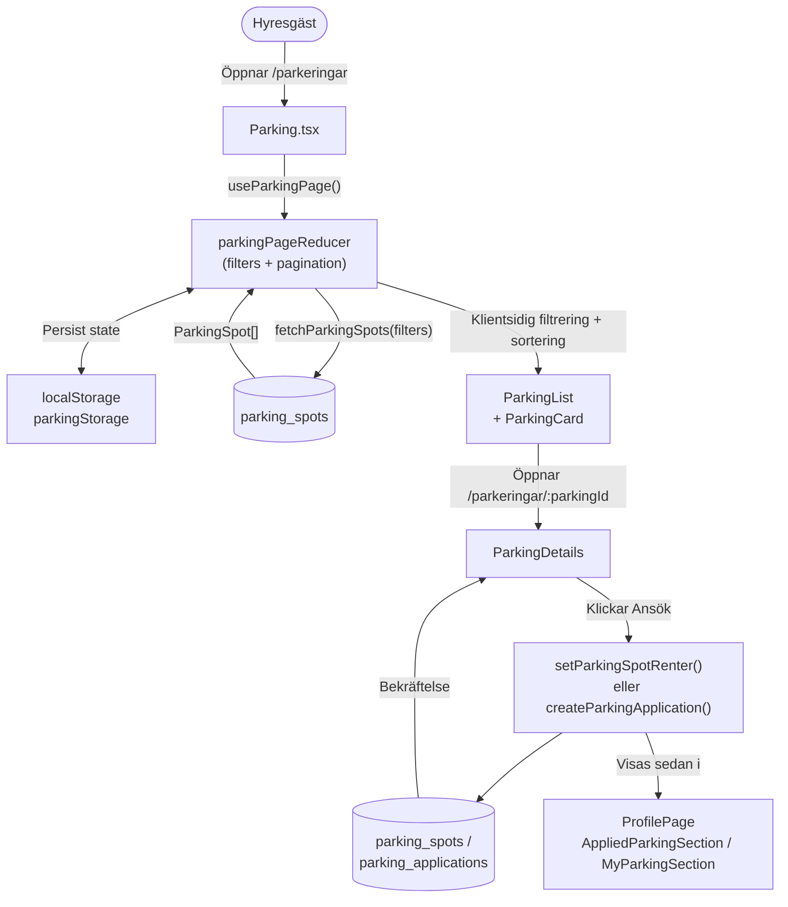
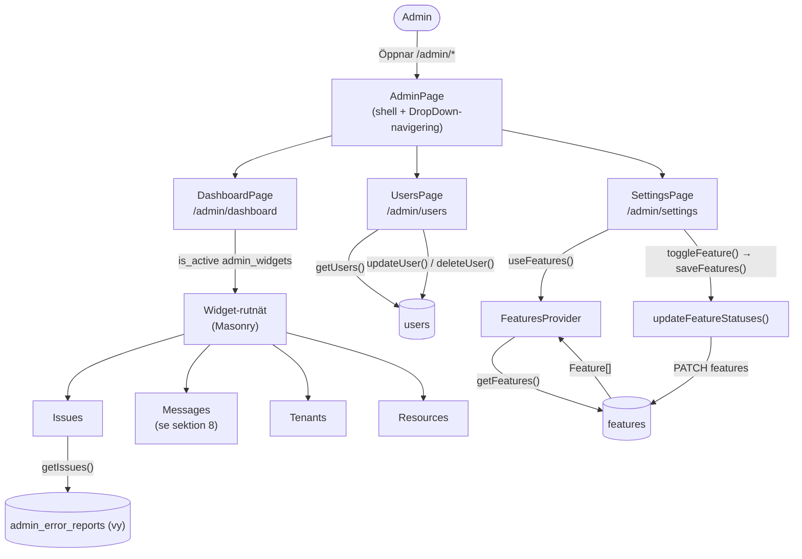
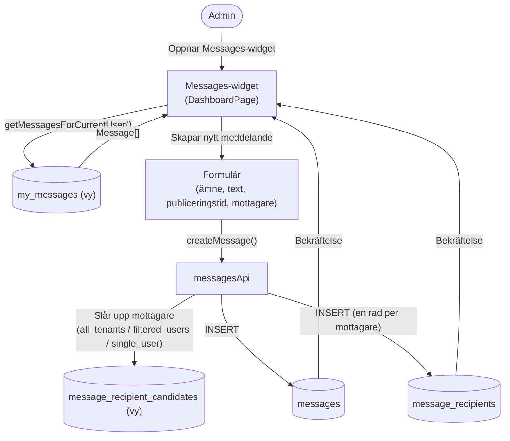

# Data Flow Diagram — Boendeportalen

Diagrammen är skrivna i Mermaid. Rendera med:
- **VS Code**: installera [Mermaid Preview](https://marketplace.visualstudio.com/items?itemName=bierner.markdown-mermaid)
- **GitHub**: renderas automatiskt i markdown-filer
- **Online**: klistra in i [mermaid.live](https://mermaid.live)

> Radbrytningar i noder görs med ` ` och kantetiketter med specialtecken (`/`, `()`, `===`) citeras — annars riskerar Mermaid parse errors.

---

## 1. Övergripande systemöversikt

---

## 2. Autentiseringsflöde

> Behörighet styrs av `hasAdminAccess(profile)` ([utils/accessControl.ts](../src/utils/accessControl.ts)), som ger åtkomst om `role === 'admin'` **eller** `isAdmin === true`.

---

## 3. Profilsida — dataflöde

> Kontraktets PDF i `ApartmentOverviewCard` hämtas via `getContractSignedUrl()`.

---

## 4. Lägenhetssökning & intresseanmälan

---

## 5. Bokningsflöden (Tvättstuga & Gästlägenhet)

---

## 6. Parkering — filtrering & ansökan

---

## 7. Admin — dashboard, användare & inställningar

---

## 8. Meddelanden (admin → hyresgäster)

---

## Databastabeller — sammanfattning

| Tabell / vy | Beskrivning |
|-------------|-------------|
| `auth.users` | Supabase-hanterade användarkonton |
| `users` | Utökad användarprofil (namn, telefon, roll) |
| `available_apartments` | Lediga lägenheter att söka |
| `apartments` | Alla lägenheter (inkl. hyrda) |
| `apartment_equipment` | Utrustning kopplad till en lägenhet |
| `contracts` | Hyreskontrakt (kopplar hyresgäst ↔ lägenhet) |
| `apartment_sign_up` | Intresseanmälningar på lägenheter |
| `apartment_documents` | Manualer, planritningar etc. |
| `laundry_time_slots` | Tillgängliga tvättstider |
| `laundry_bookings` | Bokade tvättider |
| `guest_suite_bookings` | Bokade gästlägenheter |
| `parking_spots` | Parkeringsplatser |
| `parking_applications` | Ansökningar om parkering |
| `error_reports` | Felanmälningar |
| `error_report_attachments` | Bilagor till felanmälningar |
| `service_requests` | Serviceärenden |
| `features` | Feature flags |
| `messages` | Meddelanden skapade av admin |
| `message_recipients` | Koppling meddelande ↔ mottagare |
| `admin_error_reports` *(vy)* | Adminvy över felanmälningar (Issues-widget) |
| `my_messages` *(vy)* | Inloggad användares meddelanden |
| `message_recipient_candidates` *(vy)* | Möjliga mottagare för utskick |
